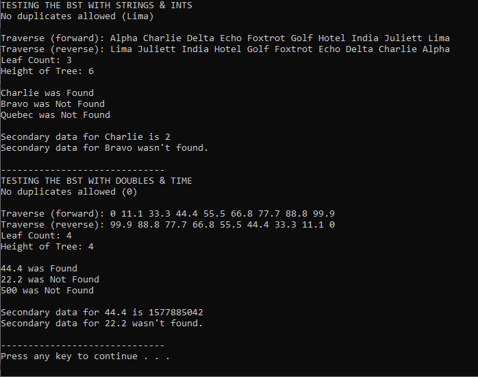

# PORTFOLIO

Words

---

## Projects

### Contact List (XML/Java)
**An Android application that stores contact information in an SQLite database.**

Utilizing the Android Room Persistance Library, this application includes a RoomDatabse, repository, DAO, and entities. It also includes a Fragment plus ViewModel design, a RecyclerView.Adapter plus CardView layout, and a number of AsyncTasks. The user interface features a Floating Action Button, as well as an overflow menu. Custom Toasts are used to communicate with the user. The application can be installed on a physical Android device via Android Studio.


```java
//Sample Code
private static class InsertAsyncTask extends AsyncTask< Contact, Void, Void> {
    private  ContactDao asyncTaskDao;
    InsertAsyncTask(ContactDao dao) { asyncTaskDao = dao; }

    @Override
    protected Void doInBackground(final Contact... params) {
        asyncTaskDao.insertContact(params[0]);
        return null;
    }
}
```
To see this project on GitHub: [Contact List](https://github.com/J-DeWolfe/ContactList.git).

---

### Tic-Tac-TOBY (Java)
**Tic-tac-toe with a primitive AI (named Toby) with whom to play against.**

Toby has two difficulty settings (default or easy) and can be disabled for two-player games. His logic can also be used by players to obtain strategic hints. Game progress can be saved mid-game and later loaded to continue the same game. An ongoing record of wins, losses, and ties is kept between sessions and displayed at the bottom of the user interface. Players can also choose the color of their X's and O's.


```java
//Sample Code
static void selectSquare(int row, int col, String player) {
    if (!gameOver && player == currentPlayer && grid[row][col] == "") {
        grid[row][col] = player;
	gui.setSquare(row, col);
	
	if (currentPlayer == "X") gui.setSquareTextColor(row, col, gui.xColor);
	else gui.setSquareTextColor(row, col, gui.oColor);
	
	setLastPlayed(row, col);
	isGameOver();
	
	if (!gameOver) changeCurrentPlayer();
	if (useToby && !gameOver && currentPlayer == "O") Toby.tobysTurn();
    }
}
```
To see this project on GitHub: [Tic-Tac-TOBY](https://github.com/J-DeWolfe/TicTacTOBY.git).

---

### Crime Data Analysis (Python)
**Reads FBI crime data from a JSON file and presents the data with a series of charts & tables (mostly pandas).**

Although this started as a class assignment, very little of the original code remains. The data is being used differently, all of the charts & tables were replaced, and most of the functions have been rewritten or renamed. Even the file names have changed. A greater emphasis has been placed on color, variety, and modularity.


```python
#Sample Code
def getSpecificCrime(crime_data, gov, crime):
    specific_crime = {}
    for city in crime_data:
        if city[gov] in specific_crime.keys():
            specific_crime[city[gov]] += int(city[crime])
        else:
            specific_crime[city[gov]] = int(city[crime])
    return specific_crime
```
To see this project on GitHub: [Crime Data Analysis](https://github.com/J-DeWolfe/CrimeDataAnalysis.git).

---

### Cipher (Java)
**A substitution cipher with a simple GUI.**

This program is useful for encrypting (and later decrypting) simple blocks of text. The same password/key used to encrypt the message can later be used to decrypt it. A different password/key will, however, produce a different result. The cipher is therefore useful for encoding common emails or text messages, private local documents, and the like. Please note that the encryption scheme is somewhat basic and shouldn't be used for truly sensitive data.


```java
//Sample Code
public String cryptIt(String pwKey, String userText) {
    createCipherGrid(pwKey); //Unique to each password/key
    String outStr = "";
		
    for (int i = 0; i < userText.length(); i++) {
        int r = findRow(userText.charAt(i));
	int c = findCol(userText.charAt(i));
			
	if (r >= 0 && c >= 0)
	    outStr += String.valueOf(cipherGrid[c][r]); //If it's in the grid
	else outStr += String.valueOf(userText.charAt(i)); //If it's not
    }
    return outStr; //Return encrypted/decrypted message
}
```
To see this project on GitHub: [Cipher](https://github.com/J-DeWolfe/Cipher.git).

---

### Dual Data BST (C++)
**A binary search tree with nodes that each hold multiple data objects.**

The DualDataBST is really just a personal experiment, but it does have a couple of potential uses.

Once such use allows complex objects to be sorted without overriding the comparison operator, simply by assigning associated primitive values to the nodes' primary data. For example, a collection of "customer" objects could be sorted by name, if the names were the also nodes' primary data and the customer objects were the nodes' secondary data.

Another use shows how the data structure could be applied to the object itself. Instead storing the object inside a node, the node design could be written directly into the object. Essentially, the object would serve as its own node. Instead of two data objects, the "node" could have as many data values as necessary. Sticking with the example above, each customer-node could include references to the left and right cusomter-nodes, allowing the BST to treat each customer as a node in and of itself.

I intend to thoroughly test both of these ideas in the future.



```cpp
//Sample Code
template <typename T1, typename T2>
T2 BST<T1, T2>::getSecondaryData(T1 item1)
{
	return getSecondaryData(root, item1); //Use root if node not specified
}

template <typename T1, typename T2>
T2 BST<T1, T2>::getSecondaryData(dualDataNode<T1, T2> *p, T1 item1)
{
	if (p == NULL) return NULL;
	if (p->data1 == item1) return p->data2;
	if (p->data1 > item1) return getSecondaryData(p->left, item1);
	else return getSecondaryData(p->right, item1); //Recursive
}
```
To see this project on GitHub: [Dual Data BST](https://github.com/J-DeWolfe/DualDataBST.git).

---

## More

More projects?
Something else?

---

## Contact Me

Put some contact info here
