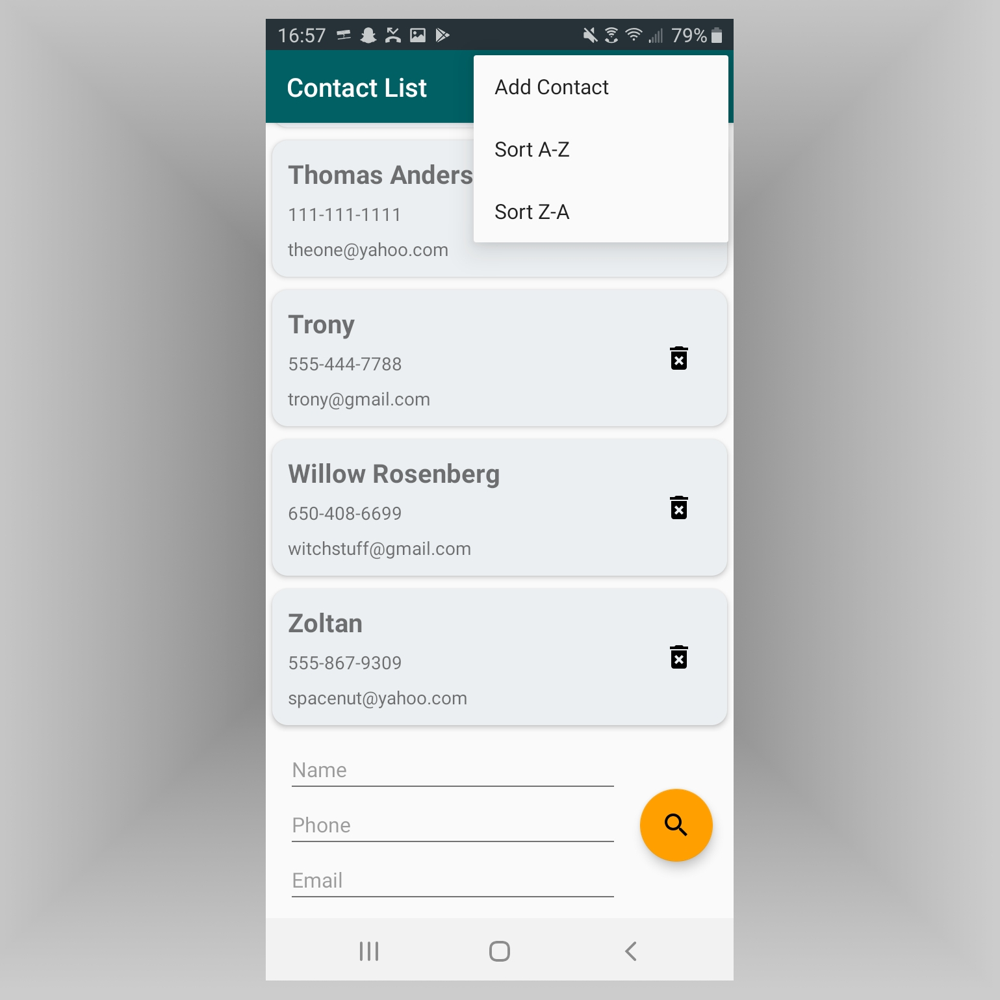

# PORTFOLIO

Words

## Projects

### Contact List (XML/Java)
**An Android application that stores contact information in an SQLite database.**

Utilizing the Android Room Persistance Library, this application includes a RoomDatabse, repository, DAO, and entities. It also includes a Fragment plus ViewModel design, a RecyclerView.Adapter plus CardView layout, and a number of AsyncTasks. The user interface features a Floating Action Button, as well as an overflow menu. Custom Toasts are used to communicate with the user. The application can be installed on a physical Android device via Android Studio.



```java
//Sample Code
private static class InsertAsyncTask extends AsyncTask< Contact, Void, Void> {
    private  ContactDao asyncTaskDao;
    InsertAsyncTask(ContactDao dao) { asyncTaskDao = dao; }

    @Override
    protected Void doInBackground(final Contact... params) {
        asyncTaskDao.insertContact(params[0]);
        return null;
    }
}
```
To see this project on GitHub: [Contact List](https://github.com/J-DeWolfe/ContactList.git).


### Tic-Tac-TOBY (Java)
**Tic-tac-toe with a primitive AI (named Toby) with whom to play against.**

Toby has two difficulty settings (default or easy) and can be disabled for two-player games. His logic can also be used by players to obtain strategic hints. Game progress can be saved mid-game and later loaded to continue the same game. An ongoing record of wins, losses, and ties is kept between sessions and displayed at the bottom of the user interface. Players can also choose the color of their X's and O's.


```java
//Sample Code
static void selectSquare(int row, int col, String player) {
    if (!gameOver && player == currentPlayer && grid[row][col] == "") {
        grid[row][col] = player;
	gui.setSquare(row, col);
	
	if (currentPlayer == "X") gui.setSquareTextColor(row, col, gui.xColor);
	else gui.setSquareTextColor(row, col, gui.oColor);
	
	setLastPlayed(row, col);
	isGameOver();
	
	if (!gameOver) changeCurrentPlayer();
	if (useToby && !gameOver && currentPlayer == "O") Toby.tobysTurn();
    }
}
```
To see this project on GitHub: [Tic-Tac-TOBY](https://github.com/J-DeWolfe/TicTacTOBY.git).


### Crime Data Analysis (Python)
Reads FBI crime data from a JSON file and presents the data with a series of charts & tables (mostly pandas).

```markdown
Sample code
Sample code
Sample code
```
For more details see [GitHub Flavored Markdown](https://guides.github.com/features/mastering-markdown/).

### Cipher (Java)
A substitution cipher with a simple GUI.

```markdown
Sample code
Sample code
Sample code
```
For more details see [GitHub Flavored Markdown](https://guides.github.com/features/mastering-markdown/).

### Dual Data BST (C++)
A binary search tree with nodes that each hold multiple data objects.

```markdown
Sample code
Sample code
Sample code
```
For more details see [GitHub Flavored Markdown](https://guides.github.com/features/mastering-markdown/).


## Something other than Projects

Your Pages site will use the layout and styles from the Jekyll theme you have selected in your [repository settings](https://github.com/J-DeWolfe/J-DeWolfe.github.io/settings). The name of this theme is saved in the Jekyll `_config.yml` configuration file.

## Support or Contact

Having trouble with Pages? Check out our [documentation](https://help.github.com/categories/github-pages-basics/) or [contact support](https://github.com/contact) and we’ll help you sort it out.
